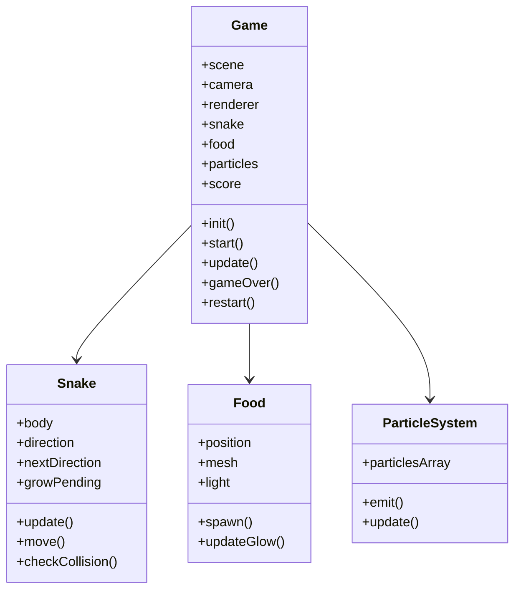

# Dokumen Keperluan Produk (PRD) - Permainan Snake 3D

## 1. Ringkasan Eksekutif
Dokumen Keperluan Produk (PRD) ini menerangkan spesifikasi, keperluan, dan reka bentuk untuk permainan **Snake 3D**. Permainan ini dibina menggunakan teknologi web standard (HTML5, CSS3, dan JavaScript) tanpa memerlukan sistem backend. Antara muka grafik 3D dihasilkan menggunakan pustaka **Three.js** melalui Content Delivery Network (CDN).

Matlamat utama adalah untuk membina permainan berasaskan pelayar (browser-based game) yang moden, mempunyai visual premium, animasi lancar, dan prestasi tinggi, serta boleh dimainkan terus hanya dengan membuka fail HTML tunggal.

---

## 2. Objektif & Matlamat
* **Akses Mudah**: Permainan boleh dijalankan terus dari fail `snake3d.html` tunggal tanpa sebarang proses pemasangan (installation).
* **Visual Premium**: Menggunakan pencahayaan, bayang, kesan glow, dan partikel untuk menghasilkan pengalaman 3D yang moden dan menarik.
* **Prestasi Optimum**: Memastikan kadar bingkai (frame rate) yang lancar (sasaran 60 FPS) dengan paparan kaunter FPS untuk pemantauan.
* **Kemudahan Kod**: Kod berstruktur bersih berasaskan Kelas JavaScript standard untuk memudahkan penyelenggaraan.

---

## 3. Spesifikasi Fungsian (Functional Requirements)

### 3.1 Arena & Platform
* **Ukuran**: Platform bersaiz grid $20 \times 20$ petak dalam ruang 3D.
* **Visual**: Reka bentuk grid 3D yang jelas di atas sebuah platform terapung.
* **Pencahayaan (Lighting)**:
  * Lampu Ambient (Ambient Light) untuk pencahayaan asas keseluruhan.
  * Lampu Berarah (Directional Light) untuk menghasilkan bayang realistik (shadow mapping) pada ular, makanan, dan platform.

### 3.2 Ular (Snake)
* **Visual Ular**:
  * Terdiri daripada blok-blok kubus 3D.
  * Kepala ular berwarna **hijau terang** (bright green).
  * Badan ular berwarna **hijau gelap** (dark green).
* **Pergerakan**:
  * Bergerak secara automatik setiap selang masa beberapa milisaat (tick rate).
  * Kelajuan pergerakan boleh diselaraskan berdasarkan skor atau tahap.
  * Animasi pergerakan yang licin menggunakan teknik *interpolation* atau *tweening* antara grid.
* **Kematian (Game Over)**:
  * Melanggar badan sendiri.
  * Keluar dari sempadan arena $20 \times 20$.

### 3.3 Makanan (Food)
* **Visual**: Berupa objek sfera berwarna **merah** dengan kesan cahaya/glow (emissive glow).
* **Penjanaan**: Muncul secara rawak di dalam grid 20x20 tanpa bertindih dengan kedudukan badan ular.
* **Kesan Apabila Dimakan**:
  * Panjang ular bertambah sebanyak 1 segmen (kubus).
  * Skor pemain bertambah.
  * Kesan partikel (particle explosion) dilepaskan di lokasi makanan dimakan.
  * Makanan baru dijana di lokasi rawak yang lain.

### 3.4 Sistem Partikel (Particle System)
* Mengeluarkan zarah-zarah kecil yang terapung dan pudar (fade out) apabila ular memakan makanan.
* Menggunakan fizik ringkas (graviti, rawak arah, dan pengurangan saiz/opacity) untuk kesan visual yang dinamik.

### 3.5 Sistem Kawalan
* **Butang Papan Kekunci (Keyboard)**:
  * `W` - Bergerak ke Depan (Forward / North)
  * `S` - Bergerak ke Belakang (Backward / South)
  * `A` - Bergerak ke Kiri (Left / West)
  * `D` - Bergerak ke Kanan (Right / East)
* Input kawalan tidak membenarkan ular berpatah balik secara langsung ke arah bertentangan (contohnya, menekan `S` semasa sedang bergerak ke depan `W`).

### 3.6 Antara Muka Pengguna (UI) & HUD
* Paparan skor (Score) dan skor tertinggi (High Score) di atas skrin (HTML overlay di atas Canvas).
* Kaunter FPS (Frames Per Second) di penjuru skrin untuk tujuan analisis prestasi.
* Skrin **Game Over**:
  * Paparan mesej "GAME OVER" yang jelas apabila ular mati.
  * Butang **Restart** untuk memulakan semula permainan tanpa perlu memuat semula (reload) halaman pelayar.

---

## 4. Seni Bina Kod & Struktur Kelas
Kod JavaScript akan diatur menggunakan struktur Kelas untuk memastikan modulariti:

* **Class Game**: Menguruskan setup Three.js (Scene, Camera, Renderer), *game loop*, skor, pengesanan perlanggaran utama, dan logik mula/tamat permainan.
* **Class Snake**: Menguruskan kedudukan segmen ular, logik pergerakan, kawalan arah, dan tumbesaran ular.
* **Class Food**: Menguruskan sfera makanan, pencahayaan glow, dan penjanaan lokasi rawak baru.
* **Class ParticleSystem**: Menguruskan penciptaan, animasi, dan pemusnahan partikel kesan visual.

---

## 5. Keperluan Bukan Fungsian (Non-Functional Requirements)
* **Kemuatan Fail**: Semua kod (HTML, CSS, JS) mesti terkandung dalam **satu fail HTML tunggal** (`snake3d.html`).
* **Kelebaran Band**: Penggunaan CDN Three.js yang boleh dipercayai (seperti unpkg atau cdnjs).
* **Prestasi**: Permainan berjalan lancar pada kadar 60 FPS pada kebanyakan komputer riba dan PC moden.
* **Responsif**: Canvas permainan memenuhkan skrin pelayar (Viewport-filling canvas) dan menyesuaikan diri secara automatik apabila pelayar diubah saiz (window resize).

---

## 6. Ciri Bonus (Akan Dipertimbangkan)
* **OrbitControls**: Membolehkan pemain memutar dan mengezum kamera 3D menggunakan tetikus.
* **Minimap**: Paparan pelan 2D dari atas (top-down view) di penjuru skrin untuk membantu navigasi ular.
* **Kitaran Siang/Malam (Day/Night Cycle)**: Perubahan warna langit (clearColor) dan keamatan cahaya directional secara berkala untuk visual yang dinamik.
* **Kesan Bunyi (Web Audio API)**:
  * Bunyi ketika memakan makanan (eat sound).
  * Bunyi ketika Game Over.
  * Muzik latar belakang (background music) bertema retro 8-bit yang boleh dihidup/matikan.
* **Leaderboard Tempatan**: Menggunakan `localStorage` pelayar untuk menyimpan 5 skor tertinggi berserta nama pemain.
